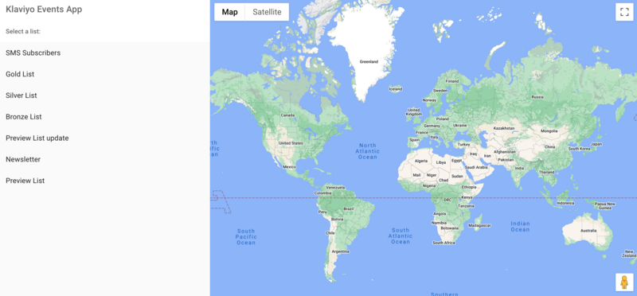

# Local Events App

The 'Local Events App' allows Klaviyo users to send news of local events to the Profiles within their accounts.

## How the App works
When the app is running, users will be prompted to enter their Private API key to log in.

Once logged in, the user will be able to select the list from their account that they wish to send local events to.

Once a list has been selected, map markers are placed on the map to visualise the profile's locations based on their lat/lng. 
The local events can then be assigned to the profiles by clicking the 'Assign local events to Profiles' button.

At this point, the events have now been assigned to the profiles. 
The Map markers on the right side of the display have now been updated to include the events assigned to each profile.
Now the user will be able to create a Campaign to send this data to their list by clicking the 'Create Campaign' button.

You will now be able to view the email itself by clicking the 'View Campaign' button which will redirect the user to the new Campaign within their Klaviyo account.

## NPM Commands
In the project directory, you can run:

### `npm run start:backend`

Launches the node backend

### `npm run start:frontend`

Runs the app in the development mode.\
Open [http://localhost:3000](http://localhost:3000) to view it in your browser.
